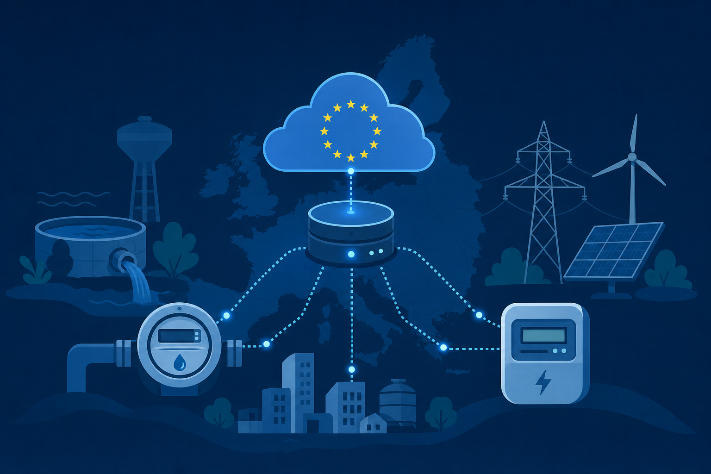

Die **AWS European Sovereign Cloud (ESC)** ist seit **Januar 2026** verfügbar — physisch isolierte EU-Infrastruktur, eigene Partition, EU-resident Operations. In DACH diskutieren viele **digitale Souveränität**: Datenhoheit, Kontrolle über Betrieb, Unabhängigkeit von Drittstaaten-Zugriff.

Die Kernfrage:

> Reicht **eu-central-1** (EU-Region), oder braucht ihr die **souveräne Partition** `aws-eusc`?

Dieser Post ist ein **Builder-Guide** — keine AWS-Werbung. Als **Solutions Architect** helfe ich bei ESC-Migrationen (CDK/Terraform), Souveränitäts-Entscheidungen und Readiness-Checks. Ich bin **AWS Community Builder**.

---

## Warum jetzt?

- **ESC GA** — souveräne AWS-Workloads sind planbar, nicht mehr „irgendwann“
- **Region** `eusc-de-east-1` (Brandenburg) — EU-Infrastruktur mit eigener Governance
- **Referenzkunden** (öffentlich): SCHUFA, ITZBund, SAP, EWE, Swiss Life — Organisationen, die Souveränität als Architektur-Entscheidung treffen
- **Politik & Beschaffung:** „souveräne Cloud“, EU-only Operations, keine Drittstaaten-Zugriffe — unabhängig vom konkreten Compliance-Framework

Wenig **deutschsprachiger Builder-Content** — die meisten Slides verkaufen Souveränität, statt zu erklären was bei Migration technisch bricht.

---

## Was ESC wirklich ist — jenseits von „Server in der EU“

EU-Region ≠ souveräne Partition. Kurz und sachlich:

| Aspekt | Standard AWS (eu-central-1) | AWS ESC (aws-eusc) |
| ------ | --------------------------- | ------------------- |
| Partition | `aws` | `aws-eusc` |
| Physische Isolation | EU-Region | Dedizierte EU-Infra, eigene Partition |
| Operations | Global AWS Ops | EU-resident, europäische Governance |
| Datenresidenz | Ja (EU) | Ja (EU) + isolierte Kontroll- und Betriebsebene |
| Service-Umfang | Voll | ~90 Services bei GA — wächst |
| Typischer Käufer | Die meisten Workloads | Souveränitäts-kritische Daten & öffentlicher Sektor |

**eu-central-1** liefert Datenresidenz. **ESC** liefert zusätzlich Partition-Isolation und EU-gesteuerten Betrieb — das ist der Souveränitäts-Sprung, nicht ein weiteres Zertifikat.

---

## Decision Framework: drei Buckets

**Zuerst klären: welche Souveränitäts-Anforderung habt ihr?** — nicht welcher Anbieter am lautesten wirbt.

### Bucket 1 — eu-central-1 reicht

- Workloads, bei denen **EU-Datenresidenz** genügt
- Kein vertraglicher Zwang zu isolierter Partition oder EU-only Operations
- Ihr wollt AWS-Vollpalette ohne Partition-Split
- **Die Mehrheit** der AWS-Kunden landet hier — und das ist okay

### Bucket 2 — ESC für definierte Workloads

- Vertraglich oder politisch: **souveräne Partition**, kein Zugriff aus Drittstaaten
- Hochsensible Daten: Gesundheit, Kredit, Bundes-IT, kritische Infrastruktur
- Hybrid: Kern auf ESC, Rest auf eu-central-1 — **phased**, nicht Big Bang

### Bucket 3 — Full sovereign stack

- ESC allein reicht politisch/rechtlich nicht
- Kombination mit On-Prem, BRZ-PaaS (AT), Hetzner, oder dediziertem Hosting
- Bewusste Architektur-Entscheidung — kein Default

In der Praxis: **Bucket 1 oder 2**. Souveränität ist Workload-spezifisch, nicht Org-weit.

---

## Was sich für Builder ändert

Marketing verschweigt die **operativen** Unterschiede zwischen Partitionen:

**Partition & Identität**

- Eigene IAM-Identitäten — keine 1:1-Übernahme aus `aws`
- ARN-Formate und Account-Struktur neu denken (Landing Zone)

**DNS & Netzwerk**

- Route53-Verhalten und Zonen — häufiger Stolperstein
- Cross-Partition-Referenzen planen oder vermeiden

**IaC / CDK**

- Region `eusc-de-east-1`, Partition `aws-eusc`
- Hardcodierte ARNs aus eu-central-1 brechen
- CI/CD: separate Credentials, ggf. separate Pipelines

**Service-Verfügbarkeit**

- Serverless-Stack bei GA — vor Design prüfen
- „In eu-central-1 verfügbar“ ≠ „in ESC verfügbar“

Typischer Pfad: **Readiness → Landing Zone → Pilot → schrittweise Migration**.

---

## Case Studies: Wer setzt auf ESC?

AWS veröffentlicht bei Launch-Kunden meist **Quotes und Richtung** — selten CDK-Migrationspfade oder Account-Strukturen. Trotzdem lohnt sich ein Blick: **warum** Organisationen ESC wählen und **was** öffentlich zum konkreten Einsatz bekannt ist.

Gemeinsames Muster: nicht Org-weiter Big Bang, sondern **souveränitäts-kritische Workloads** — oft hybrid neben eu-central-1.

### SCHUFA — Finance & Kreditdaten

**Branche:** Finanzdaten / Auskunftei  
**Warum ESC:** 69 Mio. Verbraucher-Datensätze; isolierte EU-Infra, nur EU-Personal, kein Zugriff von außerhalb Europa — Souveränität ohne Innovationsverlust.  
**Was bekannt ist:**

- Migration von **On-Prem und anderen Cloud-Workloads** auf ESC
- Neues **Credit-Scoring-System** mit transparenter Darstellung für Verbraucher (Kriterien + Gewichtung)
- CTO Klaus Kolitz: Innovation und Souveränität zusammen, nicht entweder/oder

**Quellen:** [About Amazon — Who's choosing ESC](https://www.aboutamazon.eu/news/aws/sovereignty-without-compromise-whos-choosing-the-aws-european-sovereign-cloud) · [AWS ESC Customers](https://aws.eu/european-sovereign-cloud/customers/)

---

### Diehl Metering — Smart Meter & kritische Infrastruktur

**Branche:** Smart Metering (Wasser/Energie), B2B2G  
**Warum ESC:** Öffentliche Kunden (Stadtwerke, Wasserwerke) verlangen EU-Datenhaltung und EU-Betrieb.  
**Was bekannt ist:**

- **Smart-Metering-Datenplattform** auf ESC
- Modulare Services: **Monitoring, Billing**
- Zentrales System für Wasser-/Energiedaten kritischer Infrastruktur
- Skalierung der Plattform ohne den Aufwand eines komplett eigenen Sovereign-Stacks

**Quellen:** [About Amazon — Who's choosing ESC](https://www.aboutamazon.eu/news/aws/sovereignty-without-compromise-whos-choosing-the-aws-european-sovereign-cloud) · [The Register (Mai 2026)](https://www.theregister.com/paas-and-iaas/2026/05/21/aws-parades-orgs-that-took-up-its-offer-for-euro-sovereign-cloud/5244197)

---

### Universitätsklinikum Essen — Sovereign AI in der Medizin

**Branche:** Universitätsmedizin / Forschung  
**Warum ESC:** Health Data at Scale unter deutschen und europäischen Souveränitäts-Erwartungen.  
**Was bekannt ist:**

- **IKIM** (Institut für KI in der Medizin) nutzt ESC als Basis für KI-Forschung
- Ziel: medizinische Forschung in die Klinik überführen — mit Patientendaten in souveräner Umgebung
- Eher **Transformations- und Forschungspfad** als dokumentierte Vollmigration eines Klinik-ERP

**Quellen:** [About Amazon — Who's choosing ESC](https://www.aboutamazon.eu/news/aws/sovereignty-without-compromise-whos-choosing-the-aws-european-sovereign-cloud) · [AWS Public Sector — Healthcare & Sovereignty](https://aws.amazon.com/blogs/publicsector/how-healthcare-organizations-are-advancing-innovation-while-meeting-digital-sovereignty-requirements-with-aws/)

---

### Medizinische Universität Lausitz – Carl Thiem — regionales Gesundheitsökosystem

**Branche:** Gesundheit / Forschung (Brandenburg)  
**Warum ESC:** Souveräne digitale Basis für das „Gesundheitsmodellregion Lausatia“.  
**Was bekannt ist:**

- Vernetzung von **Krankenhäusern, Forschung, regionalen Partnern**
- Sichere, souveräne Grundlage für Care, Research, Education
- Nähe zur ESC-Region Brandenburg (`eusc-de-east-1`)

**Quelle:** [AWS ESC Customers](https://aws.eu/european-sovereign-cloud/customers/)

---

### ITZBund — Bundes-IT

**Branche:** Öffentlicher Sektor  
**Warum ESC:** Zentraler IT-Dienstleister des Bundes — strengste Anforderungen an Schutz und Souveränität.  
**Was bekannt ist:** Commitment zu ESC mit voller AWS-Service-Palette; **keine** öffentliche Workload-Liste (erwartbar bei Bundes-IT).

**Quelle:** [AWS ESC Customers](https://aws.eu/european-sovereign-cloud/customers/)

---

### EWE AG — Energie

**Branche:** Energie / Versorger  
**Warum ESC:** Sensible Versorgungsdaten und kritische Infrastruktur; Souveränität als Plattform-Strategie.  
**Was bekannt ist:** ESC als Baustein der **Plattform-Strategie** — kein einzelnes benanntes Produkt, aber klarer strategischer Einsatz.

**Quelle:** [AWS ESC Customers](https://aws.eu/european-sovereign-cloud/customers/) · [AWS Launch Press Release](https://press.aboutamazon.com/aws/2026/1/aws-launches-aws-european-sovereign-cloud-and-announces-expansion-across-europe)

---

### Eterno Health — Health-SaaS (Hybrid-Denken)

**Branche:** Ambulante Versorgung / Praxissoftware  
**Warum ESC:** EU-weite Digitalisierung der Ambulanz — Kunden mit expliziten Souveränitäts-Anforderungen.  
**Was bekannt ist:**

- Gesamter Stack bisher auf Standard-AWS; ESC als **zusätzliche Option** für sovereignty-sensitive Deployments
- **Leni** — KI-Agent (Transkription, Zusammenfassung, Patientenakte) in eigenen Test-Kliniken
- Muster: SaaS auf AWS, ESC-Partition für Kunden die sie brauchen

**Quellen:** [AWS ESC Customers](https://aws.eu/european-sovereign-cloud/customers/) · [AWS Pioneers: ETERNO](https://aws.amazon.com/solutions/case-studies/aws-pioneers-project/eterno/)

---

### Plattform-Partner (keine Endkunden, aber relevant)

| Anbieter | Was auf ESC | Souveränitäts-Winkel |
| -------- | ----------- | -------------------- |
| **SAP** | SAP Cloud ERP Private GA | Mission-critical ERP unter EU-Governance |
| **Dedalus** | Klinik-Software (540M+ Patienten) | Klinische Workflows mit Residency |
| **Arvato Systems** | Health Cloud | Healthcare-Digitalisierung souverän |

**Quellen:** [About Amazon — Who's choosing ESC](https://www.aboutamazon.eu/news/aws/sovereignty-without-compromise-whos-choosing-the-aws-european-sovereign-cloud) · [AWS Healthcare Sovereignty Blog](https://aws.amazon.com/blogs/publicsector/how-healthcare-organizations-are-advancing-innovation-while-meeting-digital-sovereignty-requirements-with-aws/)

---

**Was öffentlich fehlt** — und wo Readiness-Assessments ansetzen: IAM/Landing-Zone-Design, CDK-Migrationspfade, Timeline, Kosten. Die Lücke zwischen Marketing-Quote und Production-Migration ist groß.

---

## ESC vs. EU-Hosting auf Hetzner

Ich habe [Prod auf Hetzner für EU-Kunden](/hetzner-eu-production-de) beschrieben — **Arc Rider Universe** mit voller Datenhoheit auf EU-VMs.

| | Hetzner / Self-hosted EU | AWS ESC |
| - | ------------------------ | ------- |
| Souveränitäts-Modell | Du betreibst alles | AWS-native souveräne Partition |
| Zielgruppe | Neues Produkt, volle Kontrolle | Bestehender AWS-Shop |
| Ops-Last | Hoch | Niedriger (managed) |
| Typischer Pfad | SaaS mit EU-Prod-Pflicht | Migration souveränitäts-kritischer AWS-Workloads |

Beides kann parallel — **Hybrid** ist normal. Souveränität ist kein Either/Or.

---

## CLOUD Act & Drittstaaten-Zugriff — ehrlich

Das ist der Souveränitäts-Elefant im Raum. **eu-central-1** hostet in der EU, aber die Partition bleibt `aws`. **ESC** adressiert genau das:

- Physisch isolierte Infrastruktur in der EU
- EU-resident Operations — kein globaler Ops-Zugriff aus den USA
- Europäische Governance-Struktur

Was ESC **nicht** ersetzt:

- Vertragsprüfung (Unterauftragnehmer, Support-Pfade)
- Datenklassifikation — welche Workloads brauchen welches Souveränitäts-Level
- Politische Erwartungen vs. technische Realität

Ehrliche Einordnung schlägt Marketing. Souveränität ist Architektur **und** Vertrag.

---

## Nächster Schritt: ESC Readiness Assessment

Wenn ihr AWS nutzt oder plant und Souveränität klären wollt:

**45 Minuten, kein Pitch:**

1. Welcher **Bucket** (1/2/3) für eure Workloads
2. **CDK/Terraform-Stolpersteine** (IAM, Route53, Partition)
3. **Migrations-Fahrplan** — Pilot → Rollout, Hybrid wo sinnvoll

Talk auf dem **AWS Community Day DACH 2026** (Berlin, 15. Sep.) — *AWS European Sovereign Cloud: A Builder's Guide*.

**Kontakt:** [office@martinmueller.dev](mailto:office@martinmueller.dev) · [calendly.com/martinmueller_dev](https://calendly.com/martinmueller_dev) · [LinkedIn](https://www.linkedin.com/in/martinmueller88)

Betreff: *ESC Readiness*.

---

## Weiterführend

- [AWS European Sovereign Cloud](https://aws.eu/en/products/european-sovereign-cloud/) (offiziell)
- [Produktion auf Hetzner (EU)](/hetzner-eu-production-de) — Souveränität ohne AWS-Partition
