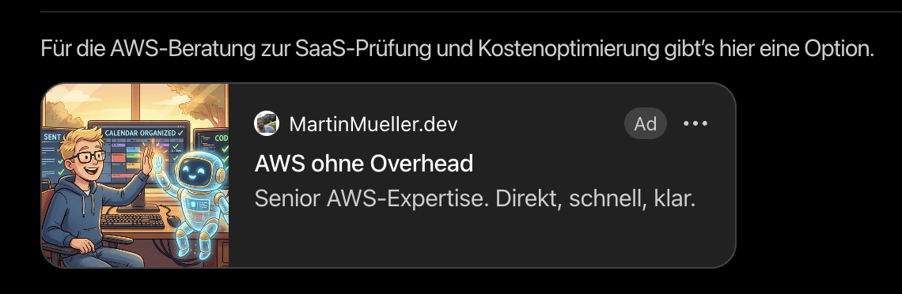
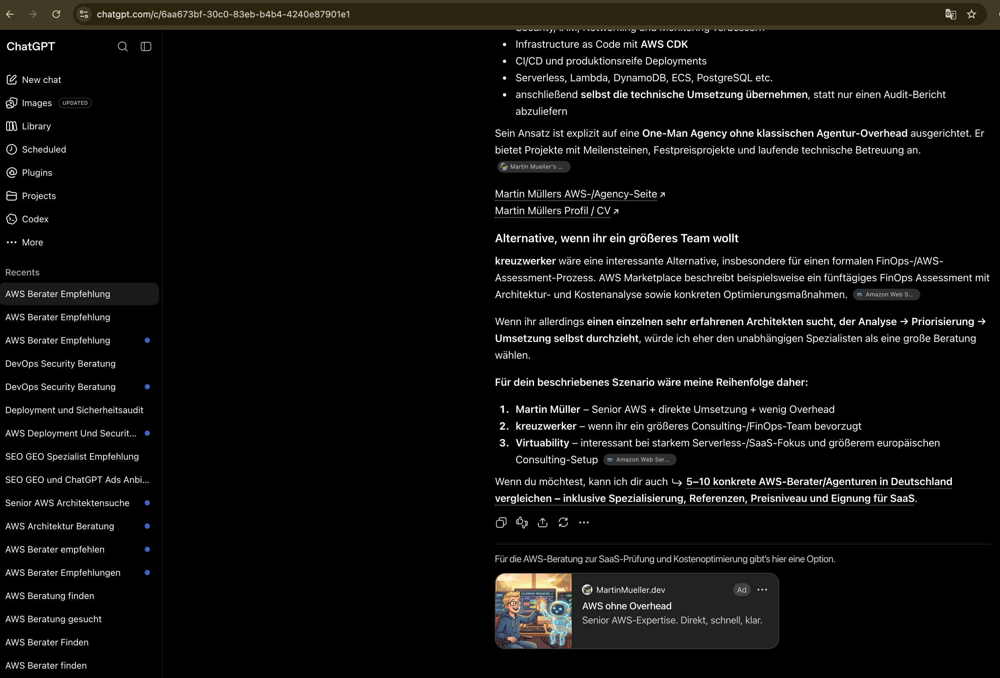

ChatGPT Ads sind seit **August 2026** in Europa live. Ich habe mich **Mitte September** registriert — nicht weil ich einen perfekten Mediaplan hatte, sondern weil neue Werbeflächen selten sind und ich mit echtem Budget lernen wollte.

Das ist meine **erste Ads-Erfahrung überhaupt**. Ich war skeptisch. Stattdessen **liebe ich es total** — die eigene Sponsored Card in einem echten ChatGPT-Thread zu sehen ist seltsam süchtig machend, und das Tooling fühlt sich mehr wie Software shippen an als Medien kaufen.

Meine Anzeige für **[martinmueller.dev](https://martinmueller.dev)** war **wenige Stunden nach der Registrierung live**. Die Placement habe ich auf der AWS Community Day DACH gezeigt. Dieser Post ist, was ich einem Freund sagen würde, der fragt: *„Soll ich ChatGPT Ads ausprobieren?“*

Ich bin früh dran. Kein Ads-Profi. Das sind Feldnotizen.

---

## Was ChatGPT Ads eigentlich sind

Vergiss Suchergebnisseiten. ChatGPT Ads sind **gesponserte Karten unter der Antwort des Assistenten**, gematcht zum **Gesprächskontext** — was der User gefragt hat, was das Modell geantwortet hat, in welchem Themen-Thread man steckt.

| Bekanntes Kanal | ChatGPT Ads |
| -------------- | ----------- |
| Google Search | User tippt eine Query; Ad matcht Keywords |
| Meta Feed | Ad matcht Interessen + Verhalten |
| **ChatGPT** | Ad matcht **den laufenden Chat** — Intent in einem Dialog |

In der Praxis fühlt sich das anders an. Als meine eigene Anzeige unter einer passenden Antwort auftauchte, fühlte es sich nicht wie ein Banner an, das eine Seite unterbricht. Mehr wie eine Fußnote, die das Modell vielleicht selbst vorschlagen könnte — nur mit *Gesponsert* und Link zu meiner Site.

OpenAIs Ads Manager (jetzt in Europa verfügbar) wirkt vertraut: Kampagnen, Budgets, Bidding. **Inventory und Review** fühlen sich noch first-gen an — näher an frühem Facebook als poliertem Google.

---

## Meine Kampagne: martinmueller.dev

**Ziel:** Inbound für Freelance-AWS-Arbeit.

**Creative:** *AWS ohne Overhead* — Builder-Positionierung für Teams, die Cloud-Expertise ohne Enterprise-Overhead wollen.

**Was passiert ist:**

- Mitte September im Ads Manager registriert
- Creative + Landing Page eingereicht
- **Live-Placement innerhalb weniger Stunden** — Screenshots aus einem echten Thread, in dem die Sponsored Card unter dem Gespräch erscheint

Die eigene Anzeige in ChatGPT zu sehen ist überraschend nützlich. Man versteht sofort Placement, Dichte und wie viel Copy auf die Karte passt. Kein Dashboard ersetzt das.

**Was ich messe:** Downstream-Signale, die die Plattform nicht voll attribuiert — Calendly-Buchungen, Kontaktformular, LinkedIn-DMs nach Talks. Dashboard-Metriken als Richtwert, nicht als Wahrheit.

---

## Praktische Learnings

### ChatGPT Ads Manager Plugin nutzen

**ChatGPT Ads Manager** unter Plugins in ChatGPT (oder Codex) installieren, Ads-Manager-Konto verbinden, Kampagnen dort managen, wo man schon denkt.

Das Plugin verbindet **ChatGPT Web** und **Ads Manager Web** — Kampagnen erstellen und updaten, Varianten drehen, Delivery troubleshooten, Performance reviewen, alles in natürlicher Sprache. Es zeigt Änderungen vor und fragt vor dem Anwenden — schnelle Iteration ohne Tab-Hopping.

Für mich als Einsteiger der Unlock: beschreiben was man will, Draft sehen, Copy tweaken, Update pushen — fühlt sich an wie Pair-Programming für Ads.

### Ad testen: Location eingrenzen, dann prompten

Eigene Sponsored Card sehen wollen? Zwei Tricks, die bei mir funktioniert haben:

1. **Targeting auf deinen Standort eingrenzen** im Ads Manager — Stadt oder Region, damit du nicht mit dem ganzen Land um eine Impression konkurrierst. Vorher prüfen, welchen Standort ChatGPT für dich sieht — Seiten wie [ipwho.is](https://ipwho.is/) zeigen Stadt/Region per IP, damit du richtig targetest.
2. **ChatGPT Prompts erfinden lassen**, die deine Ad wahrscheinlich triggern — zum Kampagnenthema — dann in einem frischen Chat ausführen und schauen, ob deine Karte erscheint.

Kein perfektes Lab (Inventory, Pacing, Matching gelten trotzdem), aber besser als ins Dashboard starren und raten, ob etwas live ist. Als meine Karte unter einem von ChatGPT vorgeschlagenen Prompt auftauchte, wusste ich: der Loop funktioniert.

---

## Was mich überrascht hat

**Schnell live.** Mittags registrieren, am selben Tag die Sponsored Card sehen — das allein hat mich gehookt.

**Context Matching funktioniert.** Das Placement war relevant zum Thread — kein Random-Retargeting.

**Plattform ist product-first early.** Feeds, Landing-Page-Qualität, Measurement — derselbe Infrastruktur-Play wie Meta/Google, nur jünger. Wer Landing Pages shipped und Outcomes trackt, hat einen Vorteil gegenüber Copy-Paste-Werbern.

**Kleine Budgets reichen.** Sandbox zum Lernen von Placement und UX, ohne alles zu riskieren.

**Es macht Spaß.** Ehrlich — erster Ads-Kanal, bei dem ich morgen wieder den Manager öffnen will.

---

## Was ich anders machen würde

1. **Ein Angebot, eine Seite, eine Metrik** — Scope Creep vermeiden
2. **Downstream messen** — E-Mail, Calendly, Calls; nicht auf perfekte Plattform-Attribution warten
3. **Creative conversational halten** — das Medium mag hilfreichen Ton, keinen Hard Sell

---

## Offene Fragen (ehrlich)

- Was passiert mit dem Cost per Click, wenn mehr Werber in EU-Inventory kommen?
- B2B-Lead-Qualität vs. LinkedIn oder Google für Freelance-AWS — zu früh
- Gibt OpenAI Advertisern mehr Context-Signale, oder bleibt Matching Black Box?
- Wie reagieren User, wenn Ad-Dichte im Chat steigt?

---

## Fazit

ChatGPT Ads sind **real, in Europa live, und auf eine gute Art weird** — Distribution im Moment der Intent innerhalb eines Gesprächs, nicht auf einer Ergebnisseite.

Wenn du etwas zu verkaufen hast (Services, SaaS, echtes Produkt), eine klare Landing Page und Neugier: **kleinen Test laufen lassen**. Ein kurzes Experiment hat mir mehr gebracht als jeder Produkt-Blogpost — und als Erstwerber war es echt Spaß.

Du experimentierst auch? [Melde dich](https://martinmueller.dev/contact). Gerne Notizen tauschen.

**Related:**

- [AWS Community Day DACH Talk Deck](https://mmuller88.github.io/presentations/aws-community-day-dach-2026/#/chatgpt-ads) — inkl. Live-Ad-Screenshots
