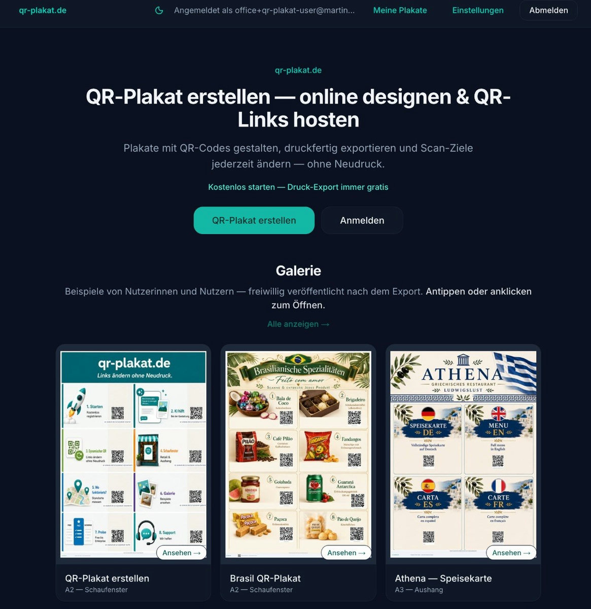

ChatGPT Ads rolled out in Europe in **August 2026**. I signed up the same week — not because I had a perfect media plan, but because new ad surfaces are rare and I wanted to learn by spending real money.

Two weeks later I had a **live sponsored placement for [martinmueller.dev](https://martinmueller.dev)** inside an actual ChatGPT conversation, a rejected submission I still do not fully understand, and a parallel experiment tying paid traffic to [qr-plakat.de](https://qr-plakat.de) affiliate guides. I showed the live ad on stage at AWS Community Day DACH. This post is what I would tell a friend who asks: *"Should I try ChatGPT Ads?"*

I am early. I am not an ads expert. These are field notes.

---

## What ChatGPT Ads actually are

Forget search results pages. ChatGPT Ads are **sponsored cards below the assistant's answer**, matched to the **conversation context** — what the user asked, what the model replied, what topic thread they are in.

| Familiar channel | ChatGPT Ads |
| ---------------- | ----------- |
| Google Search | User typed a query; ad matches keywords |
| Meta feed | Ad matches interests + behaviour |
| **ChatGPT** | Ad matches **the live chat** — intent inside a dialogue |

That feels different in practice. When I finally saw my own ad appear under a relevant answer, it did not feel like a banner interrupting a page. It felt like a footnote the model might have suggested anyway — except it was labelled *Sponsored* and pointed at my site.

OpenAI's Ads Manager (available in Europe now) looks familiar: campaigns, budgets, bidding. The **inventory and review process** still feel first-generation — closer to early Facebook than polished Google.

---

## Campaign 1: martinmueller.dev (freelance / AWS positioning)

**Goal:** inbound interest for freelance AWS work — not e-commerce, not affiliate clicks.

**Creative angle:** *AWS ohne Overhead* — builder positioning for teams that want cloud expertise without enterprise overhead.

**What happened:**

- Submitted creative + landing page through Ads Manager
- One submission came back **not approved** (13 September — no detailed reason in the UI)
- Adjusted and got a **live placement** — I have screenshots from a real thread where the sponsored card shows under the conversation


Seeing your own ad inside ChatGPT is oddly useful. You immediately understand placement, density, and how much copy fits on the card. No dashboard replicates that.

**What I am measuring:** downstream signals the platform will not fully attribute for you — Calendly bookings, contact form, LinkedIn DMs after talks. Treat dashboard metrics as directional, not gospel.

---

## Campaign 2: qr-plakat.de + affiliates

In parallel I explored **[qr-plakat.de](https://qr-plakat.de)** — QR landing pages that route to honest product comparisons with affiliate links (AWIN, ADCELL, Impact).

[](https://qr-plakat.de)

**The funnel:**

```
ChatGPT Ad or QR scan
        ↓
  /p/food-kaffee-abo  (guide / comparison)
        ↓
  Affiliate link → merchant
```

**Why I like the landing-page layer:**

- You control the story (comparison, pros/cons, Werbelink disclosure)
- Same URL works offline (A2 poster in a café) and online (ChatGPT Ad)
- Merchants and networks see a real publisher site, not a raw redirect

**Why paid + affiliate is harder:**

Consumer food affiliates pay small commissions per sale. Paid chat placements cost real money per click. Stacking the two without a clear offer of your own is easy to get wrong — you need either high-intent traffic, a stronger merchant deal, or organic reach first.

**Lesson:** Run ChatGPT Ads for **your own offer** first. Add affiliate layers only when the funnel already works without paid traffic.

I also used the live martinmueller.dev ad as proof of active paid traffic when arguing publisher review with ADCELL (qr-plakat's German affiliate network) — a side effect I did not plan for.

---

## What surprised me

**Context matching works.** The placement I saw was relevant to the thread — not random retargeting noise.

**The platform is product-first early.** Feeds, landing page quality, measurement hooks — the same infrastructure play as Meta/Google, just younger. If you are a builder who ships landing pages and tracks outcomes, you have an edge over copy-paste advertisers.

**Review is opaque.** One campaign rejected, little explanation. Small budget — I treated it as tuition.

**Small budgets are fine.** This is a sandbox. You learn placement and UX without betting the farm.

---

## What I would do differently

1. **One offer, one page, one metric** — not eight QR codes on day one
2. **Own product before affiliate** — martinmueller.dev was the right first bet
3. **Measure downstream** — email, Calendly, calls; do not wait for perfect platform attribution
4. **Keep creative conversational** — guides and comparisons fit the medium; hard sell does not
5. **Document everything** — screenshots, rejection emails, early notes; the channel will mature fast

---

## Open questions (honest)

- What happens to cost per click when more advertisers pile into EU inventory?
- B2B lead quality vs LinkedIn or Google for freelance AWS work — too early to say
- Will OpenAI expose more context signals to advertisers, or keep matching a black box?
- How will users react as ad density increases inside chat?

---

## Bottom line

ChatGPT Ads are **real, live in Europe, and weird in a good way** — distribution at the moment of intent inside a conversation, not on a results page.

If you have something to sell (services, SaaS, a real product), a clear landing page, and tolerance for ambiguous review: **run a small test**. A short experiment taught me more than any product blog post.

If you are experimenting too — [reach out](https://martinmueller.dev/contact). Happy to swap notes.

**Related:**

- [qr-plakat.de](https://qr-plakat.de) — QR guides + affiliate experiments
- [AWS Community Day DACH talk deck](https://mmuller88.github.io/presentations/aws-community-day-dach-2026/#/chatgpt-ads) — includes the live ad screenshots
