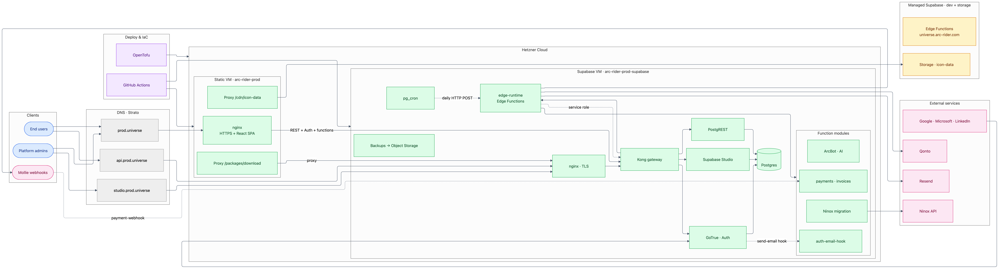

_Part 2 (self-hosted observability, cost guardrails, AI agents) — coming soon._

A **German client** needed **production in the EU on Hetzner** — clear control over where customer data and login live. The product is **Arc Rider Universe**: the SaaS behind [universe.arc-rider.com](https://universe.arc-rider.com/) — _Mission: Interface_, a UI toolkit for builders (tables, Kanban, Gantt, layouts, and more via JSON instead of hand-rolled UI code). It already ran happily on **Netlify** and **managed Supabase**. The goal was a **second prod environment on Hetzner**, not a big-bang migration that would slow down the team on Netlify.

---

## Why Hetzner, and why not “move everything at once”

The client is in Germany. Prod had to sit on **EU infrastructure they can point to** — Hetzner VMs for the app and the database.

That did **not** mean throwing away what worked:

- **[universe.arc-rider.com](https://universe.arc-rider.com/)** stayed on **Netlify** for the existing workflow.
- **Login and Postgres** moved to Hetzner.

If you are planning a similar move: you can satisfy an EU-on-Hetzner requirement **without** replatforming every hostname in one weekend.

---

## What prod looks like (in plain terms)

Users open the React app on Hetzner. Sign-in and data live on Hetzner too.

Infra and deploys are automated with **OpenTofu** (servers, firewall, DNS) and **GitHub Actions** (build, deploy, quick smoke checks after a release).

The messy part everyone underestimates: **DNS**. The domain registrar (Strato) and Hetzner both play a role. We added the new prod hostnames by hand where needed and left the Netlify record alone.

Once prod was stable, we added **self-hosted observability** on a dedicated VM — metrics, logs, traces, cost guardrails, and agent-friendly ops. That is Part 2 (coming soon).

---

## What we learned (short version)

- **Phased beats big bang** — Netlify stayed up for the existing environment while Hetzner prod came online.
- **Self-hosted login is not a copy-paste from cloud Supabase** — OAuth and magic links need prod-specific URLs and config.
- **Predictable cost and EU hosting** — VMs on Hetzner for app, login, and data.

Prod is live at [prod.universe.arc-rider.com](https://prod.universe.arc-rider.com). For this product stage, the tradeoff worked: **control where it mattered** on EU infrastructure the client can point to.

---

## Hetzner migrations — how I can help

On **Netlify**, **managed Supabase**, or **AWS** and need **prod in the EU on Hetzner**? I help with migration planning, OpenTofu, CI deploys, self-hosted Supabase on your VMs, and **self-hosted observability** (Grafana LGTM, Alloy, cost guardrails, Grafana MCP for agent-friendly ops).

[office@martinmueller.dev](mailto:office@martinmueller.dev) · [calendly.com/martinmueller_dev](https://calendly.com/martinmueller_dev)

---

## Further reading

- [Hetzner: Object Storage as OpenTofu backend](https://community.hetzner.com/tutorials/howto-hcloud-s3-terraform-backend/)
- [Supabase self-hosting (Docker)](https://supabase.com/docs/guides/self-hosting/docker)
