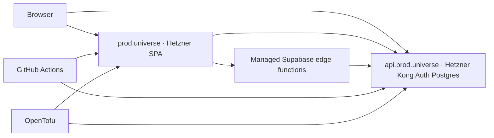

A **German client** needed **production in the EU on Hetzner** — hosting and control over where core data and auth run, not a full rip-and-replace of what already worked. The product is **Arc Rider Universe**: the SaaS behind [universe.arc-rider.com](https://universe.arc-rider.com/) — *Mission: Interface*, a UI toolkit for builders (tables, Kanban, Gantt, layouts, and more via JSON instead of hand-rolled UI code). It had shipped fast on **Netlify** and **managed Supabase**. My job was to add a **separate prod stack** on Hetzner without blocking the team on that Netlify environment.

This post is the case study: what we kept, what we moved, what broke, and what I would repeat for the next Hetzner migration.

---

## The requirement

The client is based in Germany. Prod had to run on **EU infrastructure they can reason about** — Hetzner Cloud for VMs and the primary data plane, with clear ownership of Postgres and login. That does not mean “delete Netlify” or “self-host everything Supabase offers on day one.” It means **phased hybrid**: put the sensitive core on Hetzner, keep managed pieces where they still win.

I brought an AWS-heavy background (CDK, ECS, pipelines). Here that translated to **migration design and IaC**, not reinventing the app stack.

---

## What we did not throw away

| Environment                                                           | Host                               | Role                                                |
| --------------------------------------------------------------------- | ---------------------------------- | --------------------------------------------------- |
| `universe.arc-rider.com`                                              | **Netlify**                        | Dev/staging; unchanged while Hetzner prod went live |
| `prod.universe.arc-rider.com`                                         | **Hetzner** static VM              | Customer-facing prod SPA                            |
| `api.prod.universe.arc-rider.com`                                     | **Hetzner** (self-hosted Supabase) | Postgres, Auth, REST, Kong                          |
| `studio.prod.universe.arc-rider.com`                                  | **Hetzner**                        | Supabase Studio (platform admins only)              |
| Edge functions (payments, invoices, email hook, Ninox wizard, ArcBot) | **Managed Supabase**               | Phase 1 — no Deno fleet on Hetzner yet              |

**Takeaway for migrations:** you can meet an EU-on-Hetzner bar **without** moving every hostname or every Supabase feature in one cutover.

---

## Target architecture (phase 1)

Production is **hybrid**: browser traffic hits Hetzner for the SPA and for `supabase.from(…)` / login; selected backend jobs still run as **edge functions** on the managed project, with secrets pointing back at the Hetzner API.

### What lives where

| Component                   | Location               | Notes                                   |
| --------------------------- | ---------------------- | --------------------------------------- |
| Web UI (SPA)                | Hetzner static VM      | CI build, rsync to nginx                |
| Login (magic link, OAuth)   | Hetzner GoTrue         | JWTs from Hetzner                       |
| Postgres + schema           | Hetzner API VM         | Primary prod data                       |
| REST reads/writes           | Hetzner PostgREST      | Client `supabase.from(…)`               |
| Supabase Studio             | Hetzner                | Admin only                              |
| Edge functions              | Managed Supabase       | Payments, email hook, Ninox wizard, AI  |
| Icon CDN / package download | nginx proxy → cloud    | `/cdn/icon-data/`, `/packages/download` |
| File uploads / Realtime     | Not on Hetzner yet     | Phase 2                                 |
| Infra                       | OpenTofu               | `infra/hetzner/prod`, `supabase-prod`   |
| DB backups                  | Hetzner Object Storage | Nightly on API VM                       |

Deeper component and request-flow diagrams were documented alongside the deployment (prod architecture, magic link, payments, cron).

---

## How we executed

**Infrastructure — OpenTofu** (`hcloud`): two VMs (static + Supabase), firewalls, volume, Primary IPs, Hetzner DNS RRsets. Shared `web-vm` module keeps the stacks DRY. State started in git for speed; Object Storage backend is documented for later.

**Deploy — one GitHub Actions workflow** (`Hetzner prod`, manual dispatch):

| Input             | Effect                                            |
| ----------------- | ------------------------------------------------- |
| `apply_infra`     | OpenTofu plan/apply                               |
| `deploy_static`   | Build SPA with prod env vars, rsync, nginx/TLS    |
| `deploy_supabase` | Sync Docker stack, `.env`, migrations, Studio TLS |
| `run_smoke`       | HTTPS, Kong, keys, migration count                |

Order in practice: infra → Supabase bootstrap → static → smoke.

**DNS — the surprise tax:** OpenTofu owns Hetzner zone records, but **Strato stays authoritative** for `arc-rider.com`. Manual A records for `prod.universe`, `api.prod.universe`, and `studio.prod.universe` are required before Let's Encrypt works. We deliberately **did not** repoint `universe` (Netlify). Runbooks for static host and Supabase prod were written for repeat deploys and smoke checks.

**Auth on self-hosted GoTrue:** Cloud Supabase settings do not copy verbatim. Prod needed `GOTRUE_EXTERNAL_*` for Google / Microsoft / LinkedIn, GitHub secrets, **PKCE** in the SPA, and IdP redirect URLs on `https://api.prod.universe.arc-rider.com/auth/v1/callback`.

**Deploy honesty:** Static and Supabase still ship via **SSH + rsync + docker compose**, not immutable image rolls. Fine for this stage and release cadence; at higher churn I would push container digests and pull-on-VM or proper config management.

Repo docs under `docs/opentofu/` and `docs/hetzner/` plus smoke tests (`hetzner-prod-testing.md`) kept deploys repeatable — including when using AI assistants with CLIs in the loop.

---

## Results

- **Prod URLs live:** [prod.universe.arc-rider.com](https://prod.universe.arc-rider.com) (app), `api.prod.universe…` (API/auth), `studio.prod.universe…` (admin).
- **EU core on Hetzner:** Postgres and auth on German-provider VMs; predictable VM pricing vs stacking only managed US-centric SaaS for everything.
- **Netlify path intact:** `universe.arc-rider.com` still deploys from the same repo workflow the team already knew.
- **Hybrid risk bounded:** Edge functions stay on managed Supabase; Hetzner holds data and sessions. Known phase-1 gaps: full function URL routing in the client, storage/realtime not self-hosted yet (documented in runbooks).

For this product stage the tradeoff was right: **control and residency where it mattered**, without operating a full Supabase clone on day one.

---

## Hetzner migrations — how I can help

If you are on **Netlify**, **managed Supabase**, or **AWS** and need **prod in the EU on Hetzner**, I help with:

- Hybrid architecture (what moves first, what stays managed)
- OpenTofu for VMs, DNS, firewalls, backups
- CI deploy pipelines (GitHub Actions, smoke tests, runbooks)
- Self-hosted Supabase (Auth, Postgres, Kong) alongside existing edge functions

Reach out at [office@martinmueller.dev](mailto:office@martinmueller.dev) or book a call: [calendly.com/martinmueller_dev](https://calendly.com/martinmueller_dev).

---

## Technical appendix

### Six lessons from the trenches

1. **DNS split brain (Strato + Hetzner):** Terraform records alone are not enough; verify with `dig +short` before Certbot.
2. **Kong + API keys:** Treat env write, key sync, and container recreate as one transaction, then smoke.
3. **rsync:** Exclude live Postgres data; never blind `--delete` on runtime dirs.
4. **OAuth:** Self-hosted GoTrue needs host-specific redirect URIs and enabled providers in compose — not just SPA buttons.
5. **Hybrid env vars:** Managed edge functions must get Hetzner `SUPABASE_URL` + service role; magic links and webhooks break if only one side is updated.
6. **Secrets:** No Hetzner Secrets Manager — GitHub Secrets + templated `.env` writers; document rotation.

### What already felt like real IaC

- OpenTofu for servers, firewalls, volumes, DNS RRsets — plan/apply like CDK → CloudFormation.
- PR `tofu plan`; production via `workflow_dispatch` flags.
- Git as source of truth for compose, nginx, bootstrap scripts (rsync converges toward repo).

### What still hurts (SSH layer)

Static: build `dist/`, rsync, reload nginx. Supabase: rsync stack, `write-supabase-env.sh`, `docker compose up`, recreate Kong when keys change. More imperative than ECS image deploys; acceptable here, operational debt at scale.

### Hetzner + hybrid Supabase vs typical AWS

|                   | Hetzner + OpenTofu + hybrid Supabase | Typical AWS (CDK/ECS/RDS)      |
| ----------------- | ------------------------------------ | ------------------------------ |
| **Cost**          | Predictable VM pricing               | Can grow with managed services |
| **Control**       | Full Postgres, compose on your box   | More managed, less SSH         |
| **IaC**           | OpenTofu + bash + SSH                | CDK, task defs, pipelines      |
| **Secrets**       | GitHub Secrets + files               | Secrets Manager, SSM           |
| **Observability** | Logs + smoke scripts                 | CloudWatch, mature alarms      |
| **Deploy**        | rsync / SSH / compose                | Images, rolling deploys        |
| **Auth/BaaS**     | Run GoTrue yourself                  | Cognito or managed-only BaaS   |

### Open topics for the next migration

- Remote OpenTofu state on Hetzner Object Storage (off git).
- Staging VM mirroring prod before any apex cutover.
- Tighter SSH firewall once IPs are stable.
- More immutable deploys (image digests).
- Full DNS delegation vs Strato manual A records.

---

## Related links

- [Hetzner: Object Storage as OpenTofu backend](https://community.hetzner.com/tutorials/howto-hcloud-s3-terraform-backend/)
- [Supabase self-hosting (Docker)](https://supabase.com/docs/guides/self-hosting/docker)
