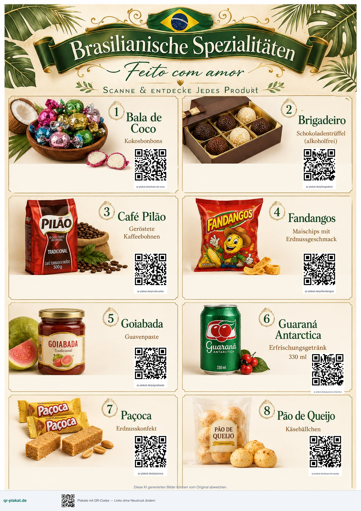

Normalerweise shipe ich Next.js als Docker-`standalone` auf **ECS Fargate** — ALB, VPC, always-on Tasks. Für ein MVP wie [qr-plakat.de](https://qr-plakat.de) bin ich stattdessen **OpenNext 4.x + AWS CDK** gegangen. Günstiger im Betrieb, schneller zu iterieren. Wenn das Produkt funktioniert, wechsle ich vielleicht zu Fargate.

Drei Dinge fühlten sich besser an als der Fargate-Weg. Deploys sind **ein GitHub-Actions-Job** von Lint bis CloudFront-Invalidierung. Infra ist **CDK, das ich schon kenne** — explizite Stacks, kein extra Deploy-Produkt. Und ich kann aus **Telegram → OpenClaw → Cursor** shippen, während ich Netflix schaue oder draußen trainiere: PR landet, Actions deployed, ich checke Prod vom Handy.

---

## Das Produkt: qr-plakat.de

[qr-plakat.de](https://qr-plakat.de) ist ein DACH-SaaS für Plakate mit QR-Codes. Im Wizard designen, ein bis acht Codes overlayen, 300-dpi-PDF oder JPG exportieren. Jedes Plakat bekommt gehostete Scan-URLs wie `qr-plakat.de/p/{slug}`, die du ohne Neudruck ändern kannst. Alles läuft in **eu-central-1**.

Das erste echte Plakat ist das Brasil-Schaufensterplakat — acht Produkte, acht QR-Codes, druckfertig aus dem Editor.

Abos sind **gemockt**. Ich bin der einzige User, kein Stripe-Checkout. Will jemand ein höheres Tier, fragt er im **Support-Chat** an und ich setze den Plan manuell. Echtes Billing kommt, wenn ich das erste Business überzeuge.

---

## Warum OpenNext + CDK für ein MVP

**OpenNext + CDK ist die beste Wahl für MVPs** — niedrige Kosten, schnelle Iteration. Wenn das Produkt funktioniert, wechsle ich vielleicht zu ECS Fargate.

Fargate will Baseline-Tasks, VPC und ALB — auch wenn fast niemand die Site trifft. OpenNext mappt die Next.js-App auf **pay-per-request Lambda**, mit CloudFront und S3 davor. App Router, RSC und Server Actions bleiben. Kein `next start` im Container.

Ich bin bei **CDK** geblieben — explizite Stacks, dieselbe IaC, die ich sonst nutze. DynamoDB, S3 und Cognito heißen **kein VPC** für die Data Plane.

Der ECS-Fargate-Weg von [listings-mcp](/aws-mcp-listings) ist die spätere Stufe: always-on, lange Jobs, wenn Traffic und Product-Market-Fit es rechtfertigen.

---

## Stack

<table class="stack-table">
<thead>
<tr><th>Layer</th><th>Tools</th></tr>
</thead>
<tbody>
<tr><th>Frontend</th><td> <a href="https://nextjs.org">Next.js</a> 16 App Router ·  <a href="https://react.dev">React</a> 19 ·  <a href="https://ui.shadcn.com">shadcn/ui</a> ·  <a href="https://tailwindcss.com">Tailwind</a> 4</td></tr>
<tr><th>Hosting</th><td> <a href="https://github.com/opennextjs/opennextjs-aws"><code>@opennextjs/aws</code></a> →  <a href="https://aws.amazon.com/lambda/">Lambda</a> ARM64 (2048 MB, 60s) ·  <a href="https://aws.amazon.com/cloudfront/">CloudFront</a> ·  <a href="https://aws.amazon.com/s3/">S3</a></td></tr>
<tr><th>IaC</th><td> <a href="https://aws.amazon.com/cdk/">AWS CDK</a> Stacks: Data → Auth → Web → Observability (+ CI/CD OIDC) ·  <a href="https://github.com/berenddeboer/cdk-opennext">cdk-opennext</a> <code>NextjsSite</code></td></tr>
<tr><th>Auth</th><td> <a href="https://aws.amazon.com/cognito/">Cognito</a> ×2 (Creators / Admins)</td></tr>
<tr><th>Data</th><td> <a href="https://electrodb.dev">ElectroDB</a> auf DynamoDB Single-Table</td></tr>
<tr><th>DNS</th><td> <a href="https://aws.amazon.com/route53/">Route 53</a> <code>qr-plakat.de</code></td></tr>
</tbody>
</table>

---

## GitHub Actions — der Teil, den ich liebe

Ein Job. Kein Artifact-Hop zwischen Build und Deploy. Der Runner lintet, typecheckt und testet, dann `next build`, `open-next build`, `cdk synth`. Danach IAM-Rolle per OIDC, `cdk deploy --all`, CloudFront `/*` invalidieren.

PRs auf `main` shippen Prod. Absichtlich. Dependabot nur CI.

Deshalb funktioniert Telegram-Shipping: Agent öffnet PR, Actions deployed, ich checke live vom Handy.

---

## Agentischer Loop

Über [OpenClaw](/openclaw-de) und [drei Monate später](/openclaw-three-months-later-de) habe ich schon geschrieben. Auf diesem Projekt derselbe Loop, nur auf qr-plakat gerichtet.

Voice oder kurzer Text auf Telegram — Netflix oder Training draußen. OpenClaw auf dem VPS gibt an Cursor im echten Repo. Cursor macht `git pull`, liest [AGENTS.md](https://github.com/mmuller88/qr-plakat) und `docs/`, implementiert, öffnet PR. Produktentscheidungen in `docs/` und ADRs — nicht im Chat vergraben.

---

## MCPs, die ich wirklich genutzt habe

Cursor mit wenigen MCPs auf dem Repo. **shadcn** für Komponenten. **aws-knowledge-mcp** für AWS-Docs beim CDK-Schreiben. **playwright** für Browser-Checks. **firecrawl** zum Scrapen/Recherchieren. **sistrix** für DACH-SEO. **pdf-reader** für Print- und Export-PDFs.

---

## Skills, die geholfen haben

Die nützlichen Skills hatte ich schon: `aws-cdk-development` und `aws-serverless` für Infra, `vercel-react-best-practices`, `shadcn-ui`, `tailwind-patterns` für die App, `ci-cd-pipeline-builder` für Actions, `seo-audit` und `seo-meta` für Landing Pages, plus `playwright-cli`, `diagnosing-bugs`, `code-review`.

Kein OpenNext-spezifischer Skill. CDK- und Serverless-Skills reichten.

---

## Würde ich es wieder machen

Für ein MVP: **OpenNext + CDK + ein Actions-Job + Telegram-Agents**. Günstig, schnell shippen. Wenn qr-plakat durchstartet, vielleicht Next.js auf ECS Fargate. Bis dahin serverless.

Live: [qr-plakat.de](https://qr-plakat.de).

[office@martinmueller.dev](mailto:office@martinmueller.dev) · [calendly.com/martinmueller_dev](https://calendly.com/martinmueller_dev) · [LinkedIn](https://www.linkedin.com/in/martinmueller88)

---

## Weiterlesen

- [OpenClaw](/openclaw-de)
- [OpenClaw, drei Monate später](/openclaw-three-months-later-de)
- [Next.js auf ECS Fargate + CDK](/aws-mcp-listings)
- [OpenNext AWS](https://github.com/opennextjs/opennextjs-aws)
- [cdk-opennext](https://github.com/berenddeboer/cdk-opennext)

---

## Kurs: Next.js-MVP auf OpenNext + CDK

Dieser Post ist der Walkthrough. Der Kurs ist der Build — derselbe Weg wie [qr-plakat.de](https://qr-plakat.de).

Du shippst ein Next.js-SaaS auf **OpenNext 4.x + CDK**: Lambda und CloudFront, kein Fargate. CDK-Stacks für Data, Auth, Web und CI/CD. DynamoDB Single-Table mit ElectroDB. Cognito mit eigenem Login-UI. Ein GitHub-Actions-Job von Lint bis CloudFront-Invalidierung, Route 53, **eu-central-1**.

**[Next.js MVP: OpenNext + CDK](/trainings-de/opennext-cdk-mvp/)** — dreitägiges Team-Training, vor Ort oder remote, Preis auf Anfrage.
