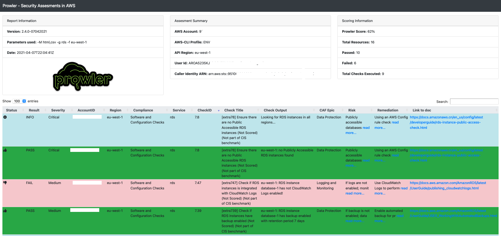
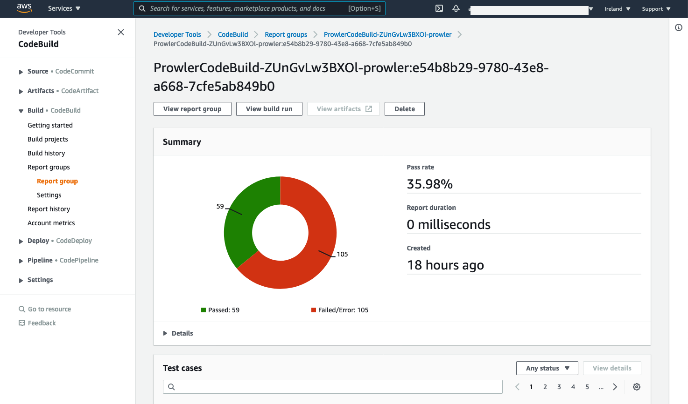

Hi Leute!

[Toni De La Fluente](https://twitter.com/ToniBlyx) hat das super coole AWS Security Tool [Prowler](https://github.com/toniblyx/prowler) entwickelt. Prowler ist ein cli tool für die Durchführung und Beratung von AWS Security Assessment, Auditing, Hardening and Incident Response. Mit mehr als 180 checks bietet Prowler dabei das umfangreichste Security Check Angebot für AWS. Wenn ihr mehr über Prowler wissen wollt besucht die [Prowler Github](https://github.com/toniblyx/prowler) Seite.

Ich benutze Prowler sehr viel und habe mich entschlossen dafür ein AWS CDK Custom Construct zu schreiben. In der Vergangenheit habe ich schon einige Custom Constructs erstellt wie meinem Favoriten der [staging pipeline](https://github.com/mmuller88/aws-cdk-staging-pipeline) oder der [build badge](https://github.com/mmuller88/aws-cdk-build-badge).

Falls ihr Prowler aber einfach nur für euren AWS Account ausführen möchtet und nicht das Custom Construct ausprobieren wollt, habe ich eine gute Nachricht. Für dem AWS Marketplace habe ich eine AMI erstellt welche das cdk-prowler construct automatisch in deinen Account installiert. Die AMI ist erhältlich im AMI Store. Dafür einfach nach Prowler suchen oder ihr nutzt den [Prowler AMI Link](https://aws.amazon.com/marketplace/pp/prodview-jlwcdlc3weta6).

Dann führt Prowler den Security Check durch und ihr findet die Security Findings in einem S3 Bucket mit Namen prowleraudit-stack-prowlerauditreportbucket den HTML Report:



Oder auch in der Codebuild Report group:



Falls ihr irgendwelche Probleme mit der AMI haben solltet, bitte schreibt mir.

Mit dem Kauf der AMI unterstützt ihr auch meine freie Arbeit zur Erstellung solcher frei erhältlichen Produkte wie dem [cdk-prowler](https://github.com/mmuller88/cdk-prowler)  custom construct und die Arbeit an meinen Blogpost. Vielen herzlichen Dank :)!

In den nächsten Abschnitten erkläre ich warum ich denke, dass ein CDK Custom Construct nützlich ist und und stelle euch das cdk-prowler Custom Construct vor. Vorweg muss ich aber erstmal erklären was AWS CDK überhaupt ist.

# AWS CDK
[AWS CDK](https://github.com/aws/aws-cdk) ist ein Open Source Framework zu Erstellung und Verwaltung von AWS Ressourcen. Durch die Verwendung von dem Entwickler vertrauten Sprachen wie TypeScript oder Python wird die Infrastructure as Code beschrieben. Dabei synthetisiert CDK den Code zu AWS Cloudformation Templates und kann diese optional gleich deployen.

AWS CDK erfährt seit 2019 ein stetigen Zuwachs von begeisterten Entwicklern und hat bereits eine starke und hilfsbereite Community die eg. sehr auf [Slack](https://cdk-dev.slack.com) aktiv ist. Es gibt natürlich noch viel mehr zu sagen über AWS CDK und ich empfehle euch es zu erforschen. Schreibt mir, wenn ihr Fragen habt.

# Motivation

AWS CDK Custom Constructs sind quasi eigene Library zum kapseln von Cloudformation Ressourcen. Diese können auf Registries wie npmjs.com oder pypi.org zum download Angeboten werden. Somit ist es extrem einfach cdk-prowler in seine CDK IDE Umgebung zu integrieren. Auch ist es sehr leicht Änderungen am cdk-prowler code durchzuführen und eine neue Version den jeweiligen Restries bereitzustellen. Vieles von diesen wichtigen aber doch mühseligen Arbeiten wird bereits durch [Projen AwsCdkConstructLibrary](https://github.com/projen/projen) stark vereinfacht.

Ein weiterer Grund für das Custom Construct ist die [Jsii](https://github.com/aws/jsii) Library. Mit dieser mega coolen Library kann ich das cdk-prowler construct zu verschiedene Sprachen wie Python, Java oder CSharp übersetzen und der Entwickler kann weiterhing in seiner gewohnten CDK Sprache mit cdk-prowler entwickeln.

# Beispiel

Das cdk-Prowler Construct ist auf [GitHub](https://github.com/mmuller88/cdk-prowler). Es muss zuerst in der package.json als Dependency eingebunden werden und kann dann im CDK Stack verwendet werden.

```ts

import { ProwlerAudit } from 'cdk-prowler';
...

const app = new App();

const stack = new Stack(app, 'ProwlerAudit-stack');

new ProwlerAudit(stack, 'ProwlerAudit');

app.synth();
```

Der AWS CDK Code zeigt wie leicht cdk-prowler deployed werden kann. Viele Zusatzfunktionen wie einem Scheduler sind bereits erhältlich und über die Properties aktivier- und änderbar . Schaut dafür doch gerne in die [API.md](https://github.com/mmuller88/cdk-prowler/blob/main/API.md).

# Ausblick

Viele coole Features für cdk-prowler sind geplant. Die Entwicklung neuer Features geschieht in Zusammenarbeit mit [Tony De La Fluente](https://twitter.com/ToniBlyx) dem Erfinder von Prowler.

Geplant ist Prowler Multiaccount ready zu machen. Somit hat man dann einen zentralisierten Ort für Prowler um alle Accounts überprüfen zu können. Multiaccount soll mit und ohne AWS Organisation funktionieren.

Zukünftig soll der Prowler nicht mehr mit Codebuild sondern mit Fargate ausgeführt werden. Das ermöglicht eine flexiblere Weiterentwicklung von Prowler um z.B. Scans zu parallelisieren. Die Prowler Scans zu parallelisieren ist ein wichtiges und sehr benötigtes Feature da mit über 180 Prowler Tests die sequentiell ausgeführt werden, die Ausführung sehr lange dauern kann.

Auch denken Tony und ich über eine verbessertes UI Analyse Tool mit QuickSight nach. Der Prowler HTML Report ist zwar sehr nützlich aber es ist schwer komplexe Abfragen and den Report zu schicken. Mit QuickSight hat man z.B. die Möglichkeit zur Definition von Filtern, Variablen usw.

# Zusammenfassung
Prowler ist mega cool und ich liebe es, dass es mir automatisiert Feedback über Security, Best Practises usw. gibt. Mit AWS CDK lässt sich ProwlerAudit leicht installieren und mit anderen Services verschachteln. Testet das ProwlerAudit Construct und gebt mir Vorschläge um es noch cooler zu machen. Gerne könnt ihr dafür auch PRs in Github erstellen.

An die tollen Leser dieses Artikels sei gesagt, dass Feedback jeglicher Art gerne gesehen ist. In Zukunft werde ich versuchen hier eine Diskussionsfunktion einzubauen. Bis dahin sendet mir doch bitte direkten Feedback über meine Sozial Media accounts wie [Twitter](https://twitter.com/MartinMueller_) oder [FaceBook](https://www.facebook.com/martin.muller.10485). Vielen Dank :).

Ich liebe es an Content Management Open Source Projekte zu arbeiten. Vieles kannst du bereits frei nutzen auf www.github.com/mmuller88 . Wenn du meine dortige Arbeit sowie meine Blog Posts toll findest, denke doch bitte darüber nach, mich zu unterstützen und ein Patreon zu werden:

<a href="https://www.patreon.com/bePatron?u=29010217" data-patreon-widget-type="become-patron-button">Werde ein Patreon!</a><script async src="https://c6.patreon.com/becomePatronButton.bundle.js"></script>